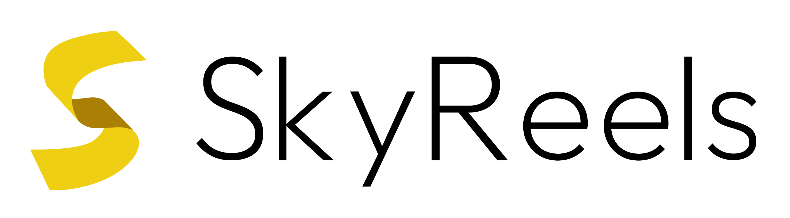

<p align="center">
  
</p>

<h1 align="center">SkyReels-A2: Compose Anything in Video Diffusion Transformers</h1> 

<div align='center'>
    <a href='https://scholar.google.com/citations?user=_43YnBcAAAAJ&hl=zh-CN' target='_blank'>Zhengcong Fei<sup> * </sup></a>&emsp;
    <a href='https://debangli.github.io/' target='_blank'>Debang Li<sup> * &dagger;</sup></a>&emsp;
    <a href='https://scholar.google.com/citations?user=6D_nzucAAAAJ&hl=en' target='_blank'>Di Qiu<sup> * &dagger;</sup></a>&emsp;
    <a href='' target='_blank'>Jiahua Wang</a>&emsp;
    <a href='' target='_blank'>Yikun Dou</a>&emsp;
    <a href='' target='_blank'>Rui Wang</a>&emsp;
</div>

<div align='center'>
    <a href='https://scholar.google.com/citations?user=bL_o7I8AAAAJ&hl=en' target='_blank'>Jingtao Xu</a>&emsp;
    <a href='' target='_blank'>Mingyuan Fan</a>&emsp;
    <a href='https://scholar.google.com.hk/citations?hl=zh-CN&user=HukWSw4AAAAJ' target='_blank'>Guibin Chen</a>&emsp;
    <a href='' target='_blank'>Yang Li</a>&emsp;
    <a href='' target='_blank'>Yahui Zhou</a>&emsp;
</div>
<div align='center'>
    <br><sup> * </sup>Equal contribution,<sup> &dagger; </sup>Project lead
    <br><strong>Skywork AI, Kunlun Inc.</strong>
</div>
<br>

<div align="center">
  <!-- <a href='LICENSE'></a> -->
  <a href='https://arxiv.org/pdf/2504.02436'></a>
  <a href='https://skyworkai.github.io/skyreels-a2.github.io/'></a>
  <a href='https://huggingface.co/Skywork/SkyReels-A2'></a>
  <a href='https://huggingface.co/datasets/Skywork/A2-Bench'></a>
  <a href='https://huggingface.co/spaces/Skywork/SkyReels_A2_Bench'></a>
  <a href='https://www.skyreels.ai'></a>
  <br>
</div>
<br>

<p align="center">
  
  <br>
  🔥 For more results, visit our <a href="https://skyworkai.github.io/skyreels-a2.github.io/"><strong>homepage</strong></a> 🔥
</p>

<p align="center">
    👋 Join our <a href="https://discord.gg/PwM6NYtccQ" target="_blank"><strong>Discord</strong></a> 
</p>

This repo, named **SkyReels-A2**, contains the official PyTorch implementation of our paper [SkyReels-A2: Compose Anything in Video Diffusion Transformers](https://arxiv.org).

## 🎉 News

* Apr 8, 2025: 🎉  We open the A2-Bench online evaluation and leaderboard. Test it on [A2-Bench Leaderboard](https://huggingface.co/spaces/Skywork/SkyReels_A2_Bench) !
* Apr 7, 2025: 🔥 [ComfyUI](https://github.com/Yuan-ManX/ComfyUI-SkyReels-A2) is now available.
* Apr 3, 2025: 🔥 We release pre-view version of checkpoints, code of model inference and gradio demo.
* Previously, we released [SkyReels-A1](https://github.com/SkyworkAI/SkyReels-A1). This is an open-sourced and effective framework for portrait image animation.

## 📑 TODO List
- [x] Support A2-Bench evaluation and leaderboard.
- [x] ComfyUI
- [x] Parallel Inference on Multi-GPUs
- [x] User-Level GPU Inference on RTX4090
- [ ] Release all model sequence, including infinity-long version.
- [ ] Diffusers

## 🪄 Models
| Models                   | Download Link                                                                                                                                                                           | Video Size         |
|--------------------------|---------------------------------------------------------------------------------------------------------------------------------------------------------------------------------------|-----------------------------------------------------------------------------------------------|
| A2-Wan2.1-14B-Preview | [Huggingface](https://huggingface.co/Skywork/SkyReels-A2) 🤗                                                                                                                                                              | ~ 81 x 480 x 832    | 
| A2-Wan2.1-14B         | [To be released](https://github.com/SkyworkAI/SkyReels-A2)  | ~ 81 x 480 x 832    | 
| A2-Wan2.1-14B-Pro         | [To be released](https://github.com/SkyworkAI/SkyReels-A2)  | ~ 97 x 544 x 960    | 
| A2-Wan2.1-14B-Infinity         | [To be released](https://github.com/SkyworkAI/SkyReels-A2)  | ~ Inf x 720 x 1080   | 


## 1. Getting Started 🏁 

### 1.1 Clone the code and prepare the environment 🛠️

First git clone the repository with code: 
```bash
git clone https://github.com/SkyworkAI/SkyReels-A2.git
cd SkyReels-A2

# create env using conda
conda create -n skyreels-a2 python=3.10
conda activate skyreels-a2
```
Then, install the remaining dependencies:
```bash
pip install -r requirements.txt
```

### 1.2 Download pretrained weights 📥

You can download the pretrained weights from HuggingFace as:
```bash
# !pip install -U "huggingface_hub[cli]"
huggingface-cli download Skywork/SkyReels-A2 --local-dir local_path --exclude "*.git*" "README.md" "docs"
```
or download from webpage mannually. 


### 1.3 Inference 🚀

You can first set the model path and reference images path and then simply run the inference scripts as: 
```bash
python infer.py
```

If the script runs successfully, you will get an output mp4 file. This file includes the following results: driving video, input image or video, and generated result.


We also support multi-GPU inference scripts for faster inference, as:
```bash
torchrun --nproc_per_node=$GPU_NUM infer_MGPU.py
```
Set the offload_switch of infer_MGPU.py to True, and you can run it on RTX4090


#### Gradio Interface 🤗

We also provide a [Gradio](https://huggingface.co/docs/hub/spaces-sdks-gradio) interface for a better user experience, just run by:

```bash
python app.py
```

The graphical interactive interface is shown as below.  


## 2. A2-Bench Evaluation 👓

We public the evaluation data in [Huggingface](https://huggingface.co/datasets/Skywork/A2-Bench), you can infer with results and then submit to [leaderboard](https://huggingface.co/spaces/Skywork/SkyReels_A2_Bench) to obtain the results automatically. 
More detail about metric computation code will coming soon.


## Acknowledgements 💐

We would like to thank the contributors of [Wan](https://github.com/Wan-Video/Wan2.1) and [finetrainers](https://github.com/a-r-r-o-w/finetrainers) repositories, for their open research and contributions. 

## Citation 💖
If you find SkyReels-A2 useful for your research, welcome to 🌟 this repo and cite our work using the following BibTeX:
```bibtex
@article{fei2025skyreels,
  title={SkyReels-A2: Compose Anything in Video Diffusion Transformers},
  author={Fei, Zhengcong and Li, Debang and Qiu, Di and Wang, Jiahua and Dou, Yikun and Wang, Rui and Xu, Jingtao and Fan, Mingyuan and Chen, Guibin and Li, Yang and others},
  journal={arXiv preprint arXiv:2504.02436},
  year={2025}
}
```
## Star History

[](https://www.star-history.com/#SkyworkAI/SkyReels-A2&Date)


